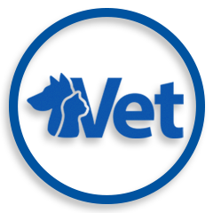

<a name="readme-top"></a>

<div align="center">
    
    <h1><b>Vet Clinic database</b></h1>
</div>

---

<!-- TABLE OF CONTENTS -->

# 📗 Table of Contents

- [📖 About the Project](#about-project)
  - [🛠 Built With](#built-with)
    - [Tech Stack](#tech-stack)
    - [Key Features](#key-features)
- [💻 Getting Started](#getting-started)
  - [Setup](#setup)
  - [Prerequisites](#prerequisites)
  - [Install](#install)
  - [Usage](#usage)
  - [Run tests](#run-tests)
  - [Deployment](#deployment)
- [👥 Authors](#authors)
- [🔭 Future Features](#future-features)
- [🤝 Contributing](#contributing)
- [⭐️ Show your support](#support)
- [🙏 Acknowledgements](#acknowledgements)
- [📝 License](#license)

---

<!-- PROJECT DESCRIPTION -->

# 📖 Vet Clinic database <a name="about-project"></a>

- This project is intended to get familiar with relational databases, SQL, PostgreSQL, psql, and pgAdmin.

<div align="center">
    
</div>

<div align="center">
    
</div>

---

#### Learning objectives

- Build a relational database based on a real-life example.

## 🛠 Built With <a name="built-with"></a>

### Tech Stack <a name="tech-stack"></a>

  <ul>
    <li>
      <a href="https://www.postgresql.org/">
        
      PostgreSQL</a>
    </li>
  </ul>

---

<!-- Features -->

### Key Features <a name="key-features"></a>

- **postgreSQL**

<p align="right">(<a href="#readme-top">back to top</a>)</p>

---

<!-- GETTING STARTED -->

## 💻 Getting Started <a name="getting-started"></a>

To get a local copy up and running, follow these steps.

### Prerequisites

In order to run this project you need:

### Setup

Clone this repository to your desired folder:

Example commands:

```bash
  cd my-folder
  git clone git@github.com:ITurres/vet-clinic-db.git
```

### Install

- N/A

### Usage

To run the project, execute the following command:

- N/A

### Run tests

- N/A

<p align="right">(<a href="#readme-top">back to top</a>)</p>

---

<!-- AUTHORS -->

## 👥 Authors <a name="authors"></a>

👤 **Arthur Iturres**

- GitHub: [@ITurres](https://github.com/ITurres)
- LinkedIn: [Arthur Emanuel G. Iturres](https://www.linkedin.com/in/arturoemanuelguerraiturres/)
- Angellist / Wellfound: [Arturo (Arthur) Emanuel Guerra Iturres](https://wellfound.com/u/arturo-arthur-emanuel-guerra-iturres)
- Youtube: [Arturo Emanuel Guerra Iturres - Youtube Channel](https://www.youtube.com/channel/UC6GFUFHOtBS9mOuI8EJ6q4g)

👤 **Mathias Wismann**

- GitHub: [@mwismann](https://github.com/mwismann)
- Twitter: [@mathias_wismann](https://twitter.com/mathias_wismann)
- LinkedIn: [Mathias Wismann](https://www.linkedin.com/in/mathias-wismann/)

<p align="right">(<a href="#readme-top">back to top</a>)</p>

---

<!-- FUTURE FEATURES -->

## 🔭 Future Features <a name="future-features"></a>

- [x] query and update animals table.
- [x] query multiple tables.
- [x] add "join table" for visits.
- [x] database performance audit.
- [x] add database schema diagram.

<p align="right">(<a href="#readme-top">back to top</a>)</p>

---

<!-- CONTRIBUTING -->

## 🤝 Contributing <a name="contributing"></a>

Contributions, issues, and feature requests are welcome!

Feel free to check the [issues page](https://github.com/ITurres/vet-clinic-db/issues).

<p align="right">(<a href="#readme-top">back to top</a>)</p>

---

<!-- SUPPORT -->

## ⭐️ Show your support <a name="support"></a>

Give a ⭐ if you liked this project!

<p align="right">(<a href="#readme-top">back to top</a>)</p>

---

<!-- ACKNOWLEDGEMENTS -->

## 🙏 Acknowledgments <a name="acknowledgements"></a>

I thank the Code Reviewers for their advice and time 🏆

<p align="right">(<a href="#readme-top">back to top</a>)</p>

---

<!-- LICENSE -->

## 📝 License <a name="license"></a>

This project is [MIT](./LICENSE) licensed.

<p align="right">(<a href="#readme-top">back to top</a>)</p>

---
